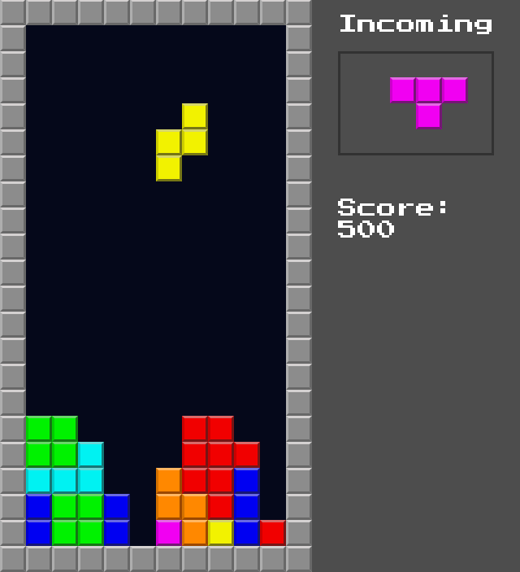

# Tetris Prototype

A gameplay-focused recreation of the classic falling-block puzzle game
built in **Godot 4** using **GDScript**.

This project was developed as a programming exercise to strengthen my
understanding of game architecture, grid-based gameplay, collision
systems, and gameplay state management. Rather than recreating every
feature of the original game, the focus was on implementing the core
mechanics from scratch.

> **Disclaimer**
>
> This is an educational project inspired by *Tetris*.
> It is not affiliated with or endorsed by the owners of the Tetris
> intellectual property. All original trademarks and intellectual
> property belong to their respective owners.

------------------------------------------------------------------------

## Features

-   Seven classic tetrominoes
-   Piece rotation
-   Horizontal movement
-   Soft drop
-   Line clearing
-   Score tracking
-   Next-piece preview
-   Game over detection
-   Restart functionality
-   Random piece generation

------------------------------------------------------------------------

## Controls

  Action       Key
  ------------ -------------------------------------
  Move Left    ←
  Move Right   →
  Rotate       ↑
  Soft Drop    ↓

------------------------------------------------------------------------

## Built With

-   **Engine:** Godot 4
-   **Language:** GDScript
-   **Rendering:** TileMapLayers
-   **UI:** Godot Control Nodes

------------------------------------------------------------------------

## Project Structure

``` text
assets/
    blocks.svg
    PressStart2P-Regular.ttf

scenes/
    main.tscn
    game_hud.tscn

scripts/
    main.gd
```

------------------------------------------------------------------------

## Technical Highlights

### Grid-Based Gameplay

The game operates on a fixed 10×20 playfield. Every tetromino is
represented as a collection of grid coordinates rather than world-space
positions, making movement, collision checks, and rotations predictable
and efficient.

### Rotation System

Each tetromino stores four predefined rotation states. Rotations are
validated before being applied to prevent pieces from intersecting walls
or occupied cells.

### 7-Bag Randomizer

Instead of selecting completely random pieces every time, the game uses
a shuffled bag containing one of each tetromino. Once the bag is empty,
it is refilled and shuffled again. This mirrors the distribution
approach used in modern implementations and avoids long streaks without
a specific piece.

### Separate Active and Settled Layers

The current falling piece is rendered independently from the settled
board using separate TileMap layers. This keeps movement and collision
logic simpler while avoiding unnecessary board updates.

### Collision Validation

Movement and rotation are validated before execution, ensuring pieces
cannot move outside the playfield or overlap locked blocks.

### Line Clearing

After a piece lands, the board is scanned for completed rows. Filled
rows are removed, higher rows shift downward, and the player's score is
updated.

------------------------------------------------------------------------

## What I Learned

This project gave me hands-on experience with:

-   Designing grid-based gameplay systems
-   Managing game state
-   Implementing collision detection
-   Creating reusable tetromino data structures
-   Separating gameplay logic from rendering
-   Working with Godot's TileMapLayer system
-   Building a complete gameplay loop from scratch

------------------------------------------------------------------------

## Possible Improvements

Some features intentionally left out to keep the prototype focused
include:

-   Ghost piece
-   Hold piece
-   Hard drop
-   Level progression
-   Increasing fall speed
-   Wall kicks (SRS)
-   T-Spin detection
-   Combo and back-to-back scoring
-   Sound effects
-   Music
-   Pause menu
-   Settings menu
-   High score saving
-   Animations and visual polish

------------------------------------------------------------------------

## Screenshots





------------------------------------------------------------------------

## License

This repository is licensed under the MIT License.

See the `LICENSE` file for more information.
